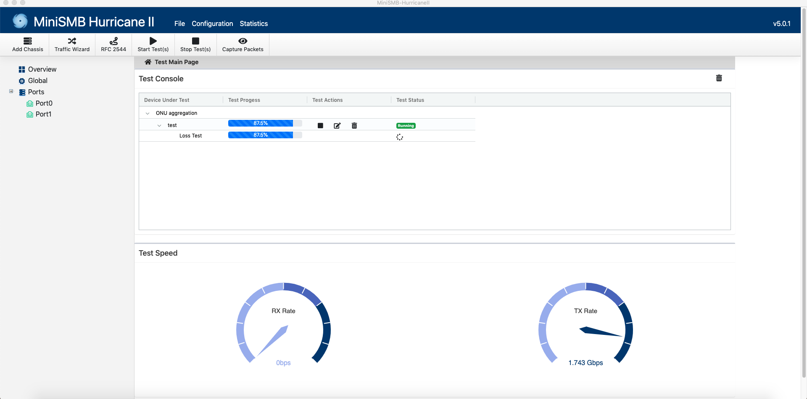

### Introduction

MiniSMB is a TCP/IP packet crafting and traffic generator tool. compare to commercial tool like Ixia IxLoad, Spirent  TestCenter, MiniSMB packet generator engine is able to running either on  commodity x86 server or a dedicate hardware solution and in terms of functionality it supports most of useful features like send rate in pps / bps, burst send mode, visualized packet editing through easy to use GUI. the performance MiniSMB could up to 14Mpps on intel 10G nic card.



### Who needs MiniSMB?
if you are currently debugging your network system,  testing your network stability, MiniSMB would be one of your best friend to crafting packet, generating packets through an easy to use GUI.

### Documentation
If you want to learn how to use MiniSMB IP traffic generator , please visit the [User Manual & Best Practice](http://docs.minismb.com).

### How to Install
MiniSMB provides a single IMG file, you could download it and burn it into your USB stick (the minimal USB stick size 2GB). change your PC BIOS to select USB as first boot device, boot up your x86 PC/Server then you will see the initial setup dialogue. please  visit the [Initial Installation](http://docs.minismb.com) for details of how to completed initial installation.

### Free edition vs Paid User
```
+-------------+-----------+------------------------------------------+
|             | Free      | Professional                             |
+-------------+-----------+------------------------------------------+
| 1Gbps Link  |  100Kpps  | no limit / $1 USD / per port, per day    |
+-------------+-----------+------------------------------------------+
| 10Gbps Link |  100kpps  | no limit / $3.5 USD / per port, per day  |
+-------------+-----------+------------------------------------------+
```
* free / Promotion only support upto two packet generator interfaces

### Contact
If you have any questions, please send email to tony.cai@minismb.com
